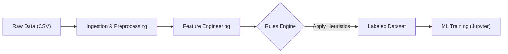

# Fraud Detection System: From Heuristics to Machine Learning

A comprehensive Data Engineering and Machine Learning pipeline that detects fraudulent banking transactions. This project ingests synthetic banking data, applies a rule-based engine to generate "ground truth" labels (Weak Supervision), and trains ML models to predict fraud based on raw transaction patterns.

> **Note:** This project consumes data generated by my [Synthetic Data Generator](https://github.com/MiguelGarrido02/synthetic-data-generator).

## Project Overview

In real-world scenarios, labeled fraud data is scarce. This project simulates a "Cold Start" problem where:
1.  **Ingestion:** We ingest raw customer and transaction data.
2.  **Feature Engineering:** We enrich data with temporal features, income ratios, and risk profiles.
3.  **Rule-Based Labeling:** A configurable **Rules Engine** applies business heuristics (e.g., *high amount in risky country*) to tag transactions as `fraud_label = 1` or `0`.
4.  **Machine Learning:** We train a model (Logistic Regression) on the **raw features** to see if it can learn to detect fraud without knowing the explicit rules.

## Architecture & Pipeline

The pipeline is modularized into stages orchestrated by `build_dataset.py`:


---
### 1. Feature Engineering
We transform raw timestamps and amounts into meaningful signals:
* **Temporal**: is_night, is_weekend (Fraudsters often act outside business hours).
* **Financial**: amount_vs_income_ratio (Detects spending anomalies relative to customer wealth).
* **Risk Scoring**: Dynamic mapping of risk weights for countries, merchant categories, and entry modes.

### 2. The Rules Engine (Labeling)
Instead of manual labeling, we use a weighted scoring system defined in fraud_rules.yaml.
* *Example Logic*: If a transaction is international AND occurs at night AND implies >30% of monthly income, the Fraud Score spikes.
* **Dynamic Thresholding**: The system automatically calculates the cutoff score to flag the top 3% (configurable) of riskiest transactions as fraud.

### 3. Machine Learning Model
We utilize Logistic Regression as a baseline model.
* **Leakage Prevention**: Crucially, the model is trained only on raw features (e.g., Amount, Region, Time). The explicit risk_scores and fraud_score used for labeling are dropped before training to prevent data leakage.
* **Split Strategy**: Temporal split (Training on past data, Testing on future data) to simulate real production environments.
---
## Results
The model successfully reverse-engineered the synthetic patterns, achieving high performance metrics on the test set:
| Metric | Score | Note |
| :--- | :--- | :--- |
| **ROC AUC** | **1.00** | Perfect separation of classes. |
| **Precision** | **0.99** | Minimal false positives. |
| **Recall** | **1.00** | Detected all fraudulent instances. |

##### *Observation: The near-perfect scores validate that the ML model successfully learned the deterministic logic embedded in the synthetic data generation and labeling process.*
---
## How To Run
1. **Prerequisites**: Ensure you have generated the raw data using the [Synthetic Data Generator](https://github.com/MiguelGarrido02/synthetic-data-generator) and placed the CSVs in data/raw/.
2. **Install Dependencies**
```bash
pip install -r requirements.txt
```
3. **Run the Pipeline (ETL + Labeling)**: This script reads config files, processes data, applies rules, and saves the labeled dataset.
```bash
python build_dataset.py
```
4. **Train the Model**: Open *experiments/raw_features_experiments.ipynb* in Jupyter/VSCode to execute the training loop and view confusion matrices.
